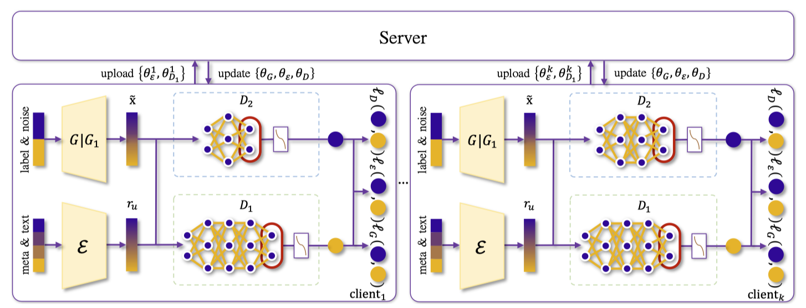
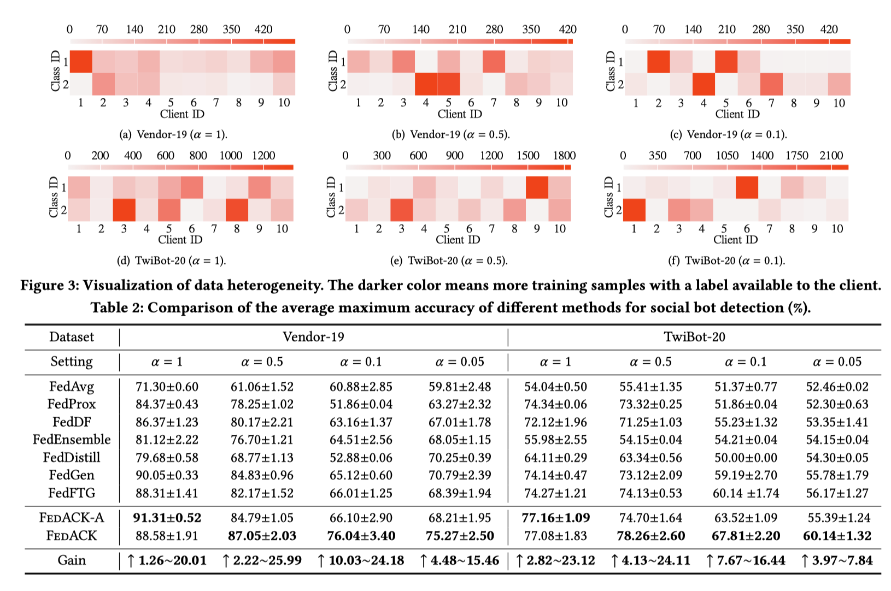

# FedACK
The code for paper "Cross Platforms Linguals and Models Social Bot Detection via Federated Adversarial Contrastive Knowledge Distillation." on Web Conference 2023 (WWW).

# Federated learning module
The code implementation of the federated learning module is stored in the FLAgorithms directory.
The model directory stored the backbone model design for social bot detection.
The implementation of server-side and client-side code for federated learning is stored in the servers/users directories.

# ~Federated learning module
The codes stored in infer,  loss, util, and model directories are used to train cross-lingual module.

The main.py is used for training FL module for social bots detection.
```python
python main.py
```
To train the federated bot detection codes.

The train.py is used for pre-traing cross-lingual module.

As for the processed data please contact us [email](mailto:dao@mail.ustc.edu.cn) and attach the information about your organization and the purpose of the data. 
The download data contains a datas directory containing processed data files, and a train_gpu3_warmup8000_latent256_kl800000_split1.0 directory contains our pre-trained cross-lingual model.

# Model


# Results



# Citation
```
@inproceedings{10.1145/3543507.3583500,
author = {Yang, Yingguang and Yang, Renyu and Peng, Hao and Li, Yangyang and Li, Tong and Liao, Yong and Zhou, Pengyuan},
title = {FedACK: Federated Adversarial Contrastive Knowledge Distillation for Cross-Lingual and Cross-Model Social Bot Detection},
year = {2023},
isbn = {9781450394161},
publisher = {Association for Computing Machinery},
address = {New York, NY, USA},
url = {https://doi.org/10.1145/3543507.3583500},
doi = {10.1145/3543507.3583500},
abstract = {Social bot detection is of paramount importance to the resilience and security of online social platforms. The state-of-the-art detection models are siloed and have largely overlooked a variety of data characteristics from multiple cross-lingual platforms. Meanwhile, the heterogeneity of data distribution and model architecture make it intricate to devise an efficient cross-platform and cross-model detection framework. In this paper, we propose FedACK, a new federated adversarial contrastive knowledge distillation framework for social bot detection. We devise a GAN-based federated knowledge distillation mechanism for efficiently transferring knowledge of data distribution among clients. In particular, a global generator is used to extract the knowledge of global data distribution and distill it into each client’s local model. We leverage local discriminator to enable customized model design and use local generator for data enhancement with hard-to-decide samples. Local training is conducted as multi-stage adversarial and contrastive learning to enable consistent feature spaces among clients and to constrain the optimization direction of local models, reducing the divergences between local and global models. Experiments demonstrate that FedACK outperforms the state-of-the-art approaches in terms of accuracy, communication efficiency, and feature space consistency.},
booktitle = {Proceedings of the ACM Web Conference 2023},
pages = {1314–1323},
numpages = {10},
keywords = {social bot detection, contrastive federated learning, knowledge distillation},
location = {Austin, TX, USA},
series = {WWW '23}
}
```

---

Have a nice day.
